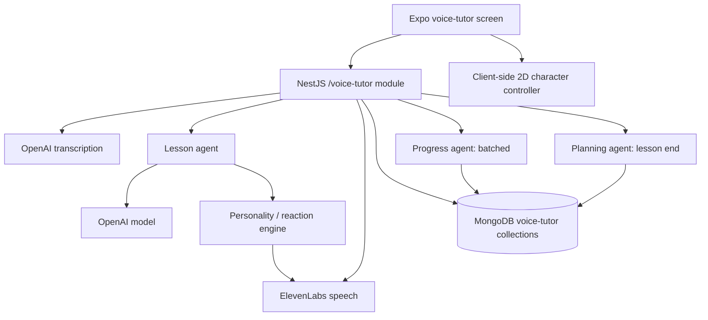

# New AI Voice Tutor: implementation boundary

The new voice tutor is a separate feature. The existing `apps/api/src/tutor`,
`apps/mobile/src/features/tutor`, and LiveKit tutor agent keep their current
routes, models, prompts, and behavior.

## Flow

The API authenticates the user with the existing JWT guard. Provider keys stay
on the API server. A turn sends the learner's recorded audio to transcription,
passes only recent messages and compact student memory to the lesson agent,
then validates emotion, delivery and gesture hints in a separate reaction
layer and synthesizes the teacher's reply with the selected voice. Progress is
updated after several turns; planning runs at lesson end. The client records
and plays audio with Expo 56 `expo-audio`.

## Isolated API contract

All endpoints require the existing bearer JWT.

| Method | Route | Purpose |
| --- | --- | --- |
| GET | `/voice-tutor/options` | Enabled voices, languages, personalities, characters |
| GET | `/voice-tutor/settings` | Saved voice, style, personality, character, language, level |
| PATCH | `/voice-tutor/settings` | Change saved settings |
| POST | `/voice-tutor/sessions` | Start a lesson and return its plan and greeting |
| GET | `/voice-tutor/sessions/:id` | Reload a user's session |
| POST | `/voice-tutor/sessions/:id/turns` | Upload one recorded audio turn; return transcript and reply |
| POST | `/voice-tutor/sessions/:id/end` | Final progress update and next plan |
| GET | `/voice-tutor/audio/:id` | Authenticated teacher MP3 playback |

The turn upload is multipart form data with an `audio` field and a 10 MB limit.
The response messages have `id`, `role`, `text`, `language`, optional `audioUrl`,
and `timestamp`. Teacher messages can also carry `displayText`, `speechText`,
`emotion`, `delivery`, `intensity`, `correction`, and `gesture`. Mobile playback
includes the JWT in the audio source headers. `POST /voice-tutor/sessions`
accepts optional `{ "settings": { "voiceId", "speechStyle",
"explanationLanguage", "koreanLevel", "personality", "characterId" } }`.
On web, playback first fetches the protected MP3 with the JWT and plays a
short-lived object URL, because browser media elements cannot attach custom
Authorization headers. The upload request has a 120-second client timeout.

## New MongoDB collections

These collections have no relationship to the existing TutorSession schema.

| Collection | Main fields | Index / lifetime |
| --- | --- | --- |
| `voice_tutor_settings` | userId, voiceId, speechStyle, explanationLanguage, koreanLevel, personality, characterId | unique userId |
| `voice_tutor_sessions` | userId, status, settings/plan snapshots, turn count, processing/endRequested | userId + createdAt |
| `voice_tutor_messages` | sessionId, userId, role, display/speech text, reaction, audio reference | sessionId + createdAt |
| `voice_tutor_memories` | userId, level, strengths, weaknesses, vocabulary, recurring mistakes, summary | unique userId |
| `voice_tutor_progress` | sessionId, analyzedTurns, structured progress | sessionId + analyzedTurns |
| `voice_tutor_plans` | userId, goal, review/new topics, target vocabulary, grammar, scenario, difficulty | userId + createdAt |
| `voice_tutor_audio` | userId, MP3 bytes, expiresAt | TTL on expiresAt (one hour) |

Voice, speech style, personality, character, and explanation language are
independent settings. Audio blobs are short lived; text history and compact memory are
kept separately. A production object store can later replace the short lived
audio collection without changing the mobile playback URL.

## Provider and model configuration

The API reads keys from environment variables, never from the mobile bundle:
`OPENAI_API_KEY`, `ELEVENLABS_API_KEY`, `ELEVENLABS_DEFAULT_VOICE_ID`,
`VOICE_TUTOR_VOICES_JSON`, `VOICE_TUTOR_LESSON_MODEL`,
`VOICE_TUTOR_PROGRESS_MODEL`, `VOICE_TUTOR_PLANNING_MODEL`, and
`VOICE_TUTOR_STT_MODEL`. The new Voice Tutor always uses `eleven_v3` for TTS;
`ELEVENLABS_MODEL` only configures the existing Tutor. Languages are controlled
by `VOICE_TUTOR_EN_ENABLED`, `VOICE_TUTOR_RU_ENABLED`, and
`VOICE_TUTOR_UZ_ENABLED` (set to `false` to disable). The mobile entry card is
gated by `EXPO_PUBLIC_VOICE_TUTOR_ENABLED=true`. Uzbek may be disabled if
voice quality is insufficient. One voice ID is retained when the response
switches from Korean to an explanation language.

## Sequence and completion criteria

1. Build and validate the independent backend and basic mobile voice lesson.
2. Add batched progress, persistent student memory, and lesson planning.
3. Add selectable personality and reaction timing from reference videos.
4. Add an independent 2D character controller and asset manifest.
5. Validate the existing Tutor remains unchanged, run focused builds and
   on-device voice tests, then review latency and provider voice quality.

The character controller, pose resolver, preloading, settings persistence,
random blink/head movement, reaction gestures, and playback-waveform mouth
switching are implemented independently of the existing Tutor. Expo Audio
sampling requires microphone permission on Android and is not supported on
every platform, so it falls back to bounded speaking cadence. Two provisional
transparent 9:16 idle sprites (`female_01/01_idle.png` and
`male_01/01_idle.png`) are bundled and selected through the manifests. Missing
mouth, blink, head, and gesture frames currently fall back to the idle sprite;
the full pose sets will be supplied later and should replace the provisional art.

The six reference videos show a specific reaction pattern: surprising learner
answer, immediate contextual reaction, correct Korean expression, and learner
retry. Their subtitles and visual flow were reviewed. Audio prosody has not
yet been directly assessed in this environment, so an actual listening test
with the chosen voice remains necessary before claiming an exact match.

After the ElevenLabs account restriction was resolved, a provider-level live
check generated MP3 with the configured voice and `eleven_v3`; OpenAI STT
transcribed that generated Korean speech correctly. This did not exercise the
authenticated HTTP session, MongoDB persistence, or microphone/playback on a
physical device. The v3 adapter now maps a laughing reaction to `[laughs]`
and strong surprise to `[shouts]` even when the lesson agent selects normal
delivery. It still applies one delivery tag per teacher turn, not multiple
within-turn shifts.

On 2026-09-28, the user-selected `gpt-5.6-terra` and `gpt-5.6-luna` each
returned valid JSON in a live provider request. The configured
`gpt-transcribe` returned a transcript from a supplied synthetic MP3. Three
synthetic lesson turns checked that an invented hunger word gets a strong
correction, an ordinary tense error gets a smaller one, and a correct retry
gets praise. This is prompt sampling, not a guarantee of identical wording or
prosody across runs. API Jest tests, API build, mobile type checking, focused
mobile lint, and an Expo Android export pass; the export includes both
provisional idle PNGs. Full mobile lint still reports six pre-existing errors
outside Voice Tutor. No Android device was attached for microphone, playback,
or complete authenticated-session testing.

Voice previews appear only for configured HTTPS `previewUrl` values. Multiple
voice choices require `VOICE_TUTOR_VOICES_JSON`; a single configured default
voice yields one choice. The mobile entry card remains gated by
`EXPO_PUBLIC_VOICE_TUTOR_ENABLED=true` until on-device verification and
deployment configuration are complete. The Voice Tutor route itself is
implemented separately from the existing Tutor.

The user approved the new collections, OpenAI/ElevenLabs transfers, the new
HTTP API contract, the personality/reaction fields, and characterId setting.
Listening quality, actual device permission/playback behavior, and the user's
final image assets must still be verified in a deployed build.
