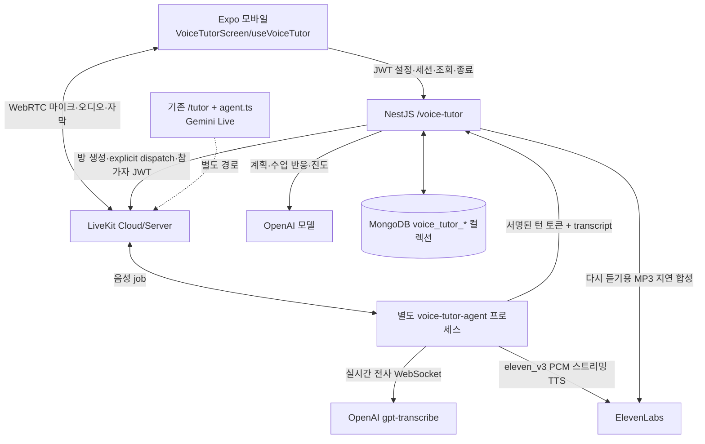

# KORIO 새 AI Voice Tutor 인수인계

기준: 2026-09-29, 확정된 코드 커밋 `3e8bcac`(LiveKit 전환), `0ce905d`(캐릭터 포즈). 이 문서는 **구현의 인수인계**이지 정상 동작 인증서가 아니다. 특히 휴대폰에서 마이크 → OpenAI 전사 → 응답 → ElevenLabs 음성까지 성공한 실기기 E2E 기록은 없다. 2026-09-29 로컬 테스트에서는 Agent의 OpenAI STT가 치명 오류로 종료됐다(아래 「확인된 실패」). 문서 작성 도중 `apps/tutor-agent/src/voice-tutor-agent.ts`, `voice-tutor-elevenlabs-tts.ts`, `apps/api/src/voice-tutor/livekit/voice-tutor-livekit.service.ts`에 **별도의 미커밋 수정**이 나타났다. 이 문서 작업은 그 수정을 만들거나 검증하지 않았다. 다음 담당자는 먼저 `git status`와 해당 파일 diff를 확인할 것.

## 1. 범위와 현 상태

- 새 Voice Tutor는 기존 `/tutor` Gemini Live Tutor와 **다른** Nest 모듈, Mongo 컬렉션, LiveKit agentName(`korio-voice-tutor` 기본값), 모바일 화면, Agent 엔트리포인트를 사용한다. 기존 Tutor를 지우거나 대체하지 않았다.
- 모바일의 새 카드/화면은 `EXPO_PUBLIC_VOICE_TUTOR_ENABLED=true`일 때 노출된다. 현재 이 기능의 클라이언트는 Expo 모바일이다. Telegram Mini App에 동일 화면이 구현됐다고 가정하지 말 것.
- 소스와 단위 테스트/빌드는 통과한 적이 있지만 실제 통화는 미검증이다. **현재 장애는 STT 단계**이며 원인(인증, 권한, 모델 세션, 네트워크 등)은 첨부 로그만으로 확정할 수 없다.
- 여기 적은 키 이름은 설정 방법 설명이다. `.env` 값과 실제 토큰은 이 문서나 이슈/채팅에 복사하지 말 것. 이 인수인계 작업은 앱 코드, DB, 배포 환경을 변경하지 않는다.

## 2. 실제 아키텍처



| 계층 | 현재 선택 | 실제 책임 |
|---|---|---|
| 모바일 | Expo 56 / React Native / LiveKit RN | 설정, WebRTC 마이크·재생·자막, 캐릭터, 종료 |
| API | NestJS / Mongoose | JWT 사용자 검증, 세션·학습 기억, 계획·반응 LLM, worker 인증, 다시 듣기 |
| 실시간 전송 | LiveKit | 방, explicit Agent dispatch, 양방향 음성 |
| 새 Worker | `apps/tutor-agent/src/voice-tutor-agent.ts` | OpenAI STT, API 턴 호출, ElevenLabs v3 TTS |
| 저장소 | MongoDB | 새 Tutor 전용 7개 컬렉션 |
| 배포 | Docker Compose | 기존 Tutor Agent와 새 Voice Tutor Agent를 별도 프로세스로 실행 |

핵심 파일:

| 위치 | 역할 |
|---|---|
| `apps/mobile/src/app/course-categories.tsx`, `src/app/voice-tutor.tsx` | 기능 플래그·화면 진입 |
| `apps/mobile/src/features/voice-tutor/screens/VoiceTutorScreen.tsx` | 설정·수업·요약 UI |
| `apps/mobile/src/features/voice-tutor/hooks/useVoiceTutor.ts` | 세션 상태와 LiveKit 연결·마이크·종료·다시 듣기 |
| `apps/mobile/src/features/voice-tutor/services/voice-tutor.api.ts` | HTTP 계약 타입·호출 |
| `apps/mobile/src/features/tutor/services/livekit-tutor.ts` | 기존 Tutor와 공유하는 LiveKit 클라이언트 전송 계층 |
| `apps/mobile/src/features/voice-tutor/character/*` | 2D 포즈·입·눈·손동작 프레임 제어 |
| `apps/api/src/voice-tutor/voice-tutor.controller.ts` | 사용자 API와 Worker 콜백 API |
| `apps/api/src/voice-tutor/voice-tutor.service.ts` | 세션, 대화, 계획, 진도, 다시 듣기 |
| `apps/api/src/voice-tutor/livekit/voice-tutor-livekit.service.ts` | 방·dispatch·사용자/Agent 토큰 |
| `apps/api/src/voice-tutor/agents/*`, `prompts/*`, `personality/*`, `memory/*` | 수업 프롬프트·반응·개인화 |
| `apps/tutor-agent/src/voice-tutor-agent.ts` | 새 LiveKit Agent와 API 턴 위임 |
| `apps/tutor-agent/src/voice-tutor-elevenlabs-tts.ts` | ElevenLabs v3 HTTP PCM 스트리밍 |
| `deploy/docker-compose.yml`, `deploy/preflight.sh`, `deploy/deploy.sh` | 프로세스·설정 확인·배포 |

주의: `apps/tutor-agent/README.md`의 아래쪽 Gemini Live 도식과 “STT/TTS를 안 붙인다”는 문장은 **기존** `src/agent.ts` 설명이다. 새 `voice-tutor-agent.ts`에는 적용되지 않는다. 공유 LiveKit 파일 상단의 Gemini 관련 주석도 같은 맥락이다. 설명보다 실제 코드를 우선할 것.

## 3. 한 수업의 순서와 경계

1. 모바일에서 `GET /voice-tutor/options`와 `GET /voice-tutor/settings`를 읽는다. 설정은 `voiceId`, `speechStyle`(`polite|casual`), `explanationLanguage`(`en|ru|uz`), `koreanLevel`, `personality` 4종, `characterId`(`female_01|male_01`)이다. 선택 가능한 목소리는 API 환경변수 `VOICE_TUTOR_VOICES_JSON`, 없으면 `ELEVENLABS_DEFAULT_VOICE_ID`에서 나온다.
2. 시작 시 모바일은 마이크 권한을 요청하고 `PATCH /voice-tutor/settings`, `POST /voice-tutor/sessions`를 보낸다. API는 설정·기억·이전 계획을 기반으로 계획과 첫 인사 문장을 저장한다. LiveKit 방 `voice-tutor-${sessionId}`를 만들고 이름이 일치하는 새 Agent로 explicit dispatch한다. 실패하면 새 세션/메시지를 정리한다.
3. 시작 응답의 `livekit: {serverUrl,roomName,participantToken}`을 모바일이 사용한다. 확정 커밋 기준 참가자 JWT는 해당 방의 마이크 발행·구독만 허용하고 데이터 발행은 막으며 유효기간은 15분이다. 문서 작성 중 나타난 미커밋 수정은 끼어들기 RPC를 위해 데이터 발행을 허용하도록 바꾼다. 보안·실기기 동작은 별도 검증이 필요하다. Worker는 dispatch metadata의 별도 65분 서명 토큰, voiceId, 첫 인사, 최대 수업 시간을 받는다. **metadata 전체를 로그로 찍으면 토큰이 노출된다.**
4. Worker는 학습자를 최대 30초 기다리고 첫 인사를 한 번만 말한다. 휴대폰 음성은 WebRTC로 LiveKit에 가고, Worker가 OpenAI `gpt-transcribe`의 Realtime STT로 전사한다. 모바일은 옛 M4A 파일 업로드를 이 경로에서 사용하지 않는다.
5. Worker는 최종 전사에 결정적 `turnId`를 붙여 `POST /voice-tutor/agent/sessions/:id/turns`로 보낸다. API는 서명 토큰/세션 상태를 검증하고 `(sessionId,turnId,role)` 중복을 막아 학습자·선생님 메시지를 저장한다. API의 OpenAI 수업 LLM이 `displayText`, `speechText`, 감정·발화 방식·강도·교정·제스처를 결정한다. Worker는 반환된 `speechText`를 ElevenLabs `eleven_v3` PCM으로 합성해 LiveKit으로 재생한다.
6. 모바일은 LiveKit Agent 상태와 `lk.transcription` 자막을 받고 저장된 메시지를 API에서 다시 동기화한다. 마이크 on/off, 끼어들기 RPC, 종료가 있다. 종료 후 진도/다음 계획을 조회한다. 선생님 메시지의 **다시 듣기**는 실시간 스트림이 아니라 API가 필요할 때 ElevenLabs v3 MP3를 만들고 인증된 URL로 제공한다.

Worker의 Agent-API 턴 요청은 409(처리 중)·일시적 전송 실패에 같은 `turnId`로 재시도한다. API의 수업 LLM 실패는 fallback 문장과 warning을 반환하는 경로가 있다. 이것이 STT/LiveKit 연결 실패까지 복구한다는 뜻은 아니다. 진도 분석 주기는 사용자 턴 6개이며 종료 시 계획 갱신 로직이 있다.

## 4. HTTP 계약 (현재 경로 그대로, `/api/v1` 아님)

| 메서드·경로 | 인증 | 역할 |
|---|---|---|
| `GET /voice-tutor/options` | 사용자 JWT | 지원 언어·목소리·선택지 |
| `GET /voice-tutor/settings` | 사용자 JWT | 저장된 설정 |
| `PATCH /voice-tutor/settings` | 사용자 JWT | 설정 저장 |
| `POST /voice-tutor/sessions` | 사용자 JWT | `{settings?}`로 수업 생성, 계획·인사·LiveKit 접속 정보 반환 |
| `GET /voice-tutor/sessions/:id` | 사용자 JWT, 소유자 확인 | 세션·메시지·진도 조회 |
| `POST /voice-tutor/sessions/:id/end` | 사용자 JWT, 소유자 확인 | 종료·진도/계획 처리 |
| `POST /voice-tutor/sessions/:id/messages/:messageId/audio` | 사용자 JWT, 소유자 확인 | 다시 듣기 오디오 지연 생성/URL 확보 |
| `GET /voice-tutor/audio/:id` | 사용자 JWT, 소유자 확인 | MP3 바이트 제공 |
| `POST /voice-tutor/agent/sessions/:id/turns` | **Worker 전용 서명 Bearer 토큰** | `{turnId,transcript}` 저장·수업 반응 반환 |
| `POST /voice-tutor/sessions/:id/turns` | 사용자 JWT, multipart `audio` | **남아 있는 옛 업로드 방식**. 현재 LiveKit 모바일 훅에서는 호출하지 않음 |

사용자 라우트에는 JWT·rate-limit guard가 있다. Worker 라우트에는 사용자 JWT guard가 없지만 `VoiceTutorService.agentTurn`이 dispatch에서 발행한 세션 범위 서명 Bearer 토큰을 검증한다. Worker 요청의 `turnId`는 영숫자/`_`/`-` 1–80자, `transcript`는 1–3000자다. 계약을 바꾸면 API DTO/응답 타입, Worker metadata/요청, 모바일 타입을 함께 확인할 것.

## 5. MongoDB 데이터 구조

`apps/api/src/voice-tutor/voice-tutor.module.ts`가 전용 7개 컬렉션을 등록한다. 기존 `/tutor` 컬렉션과 섞지 않는다.

```text
voice_tutor_settings  {userId unique, voiceId, speechStyle, explanationLanguage,
                       koreanLevel, personality, characterId}
voice_tutor_sessions  {userId, status(active|ended), settings, plan,
                       userTurnCount, progressAnalyzedTurns, processing,
                       processingAt, progressRunning, endRequested, endedAt}
voice_tutor_messages  {userId, sessionId, turnId?, role(user|teacher), text,
                       displayText?, speechText?, emotion?, delivery?, intensity?,
                       correction?, gesture?, language, audioId?}
voice_tutor_memories  {userId unique, summary, estimatedLevel, mistakes,
                       vocabulary, strongPoints, weakPoints, notes, lessonsCompleted}
voice_tutor_plans     {userId, sessionId?, plan}
voice_tutor_progress  {userId, sessionId, analyzedTurns, progress}
voice_tutor_audio     {userId, MP3 data, expiresAt}
```

메시지는 `{sessionId,createdAt,_id}` 조회 인덱스와 `{sessionId,turnId,role}` 부분 고유 인덱스를 가진다(`turnId`가 있는 메시지만). 저장된 MP3는 `expiresAt` TTL 인덱스로 약 1시간 후 삭제된다. `voice_tutor_sessions.processing` 잠금과 중복 방지 로직을 제거하면 Worker 재시도 때 같은 턴이 두 번 처리될 수 있다. 실제 운영 DB 마이그레이션/인덱스 생성 상태는 이 문서 작성 중 확인하지 않았다.

## 6. 모바일·캐릭터

- 진입은 `apps/mobile/src/app/course-categories.tsx`의 플래그 카드 → `/voice-tutor`다. 기존 `/tutor` 카드/화면과 별도다. Expo Go가 아니라 LiveKit/WebRTC 네이티브 모듈이 포함된 개발 빌드로 테스트해야 한다.
- 훅의 phase는 setup, starting, connecting, ready, recording, transcribing, thinking, speaking, ending, finished다. Agent 상태/자막을 수신해 전환한다. Agent 미참여 watchdog은 공유 LiveKit 전송 계층에 있다. 앱 비활성화 시 세션 종료가 호출된다.
- 캐릭터는 `apps/mobile/assets/images/voice-tutor/{female_01,male_01}`의 **사용자가 제공한 PNG 각 17장**, 총 34장이다. 모두 941×1672 투명 캔버스이고 `pose_idle`, `pose_mouth_*`, `pose_blink_*`, `pose_look_*`, `pose_hand_raise_*`, `pose_both_explain_*`, `pose_both_compare*` 등 포즈 이름으로 정리했다. 원본의 `tuter-charactes` 폴더에서 옮겼고 임시 idle 2장은 제거했다. 자세한 파일별 의미는 `apps/mobile/assets/images/voice-tutor/README.md`와 `character-manifest.ts`에 있다.
- 제어기는 약 55ms 간격으로 blink·시선·입·제스처 프레임을 갱신한다. 손들기/설명 동작은 단계별 포즈를 순서대로 보여 준다. 오디오 출력 amplitude가 아직 주어지지 않아 입모양은 **실제 음량 동기화가 아닌 시간 기반 fallback**이다. 숨쉬기·제스처 fade가 있다. 실기기에서 애니메이션 체감/오디오 동기화는 확인되지 않았다.

## 7. 환경변수와 실행

| 실행 장소 | 파일/주입 | 최소 관련 항목 |
|---|---|---|
| 로컬 API | `apps/api/.env` (`ConfigModule.forRoot`) | `MONGODB_URI`, JWT 설정, `LIVEKIT_URL/API_KEY/API_SECRET`, `OPENAI_API_KEY`, `ELEVENLABS_API_KEY`, 기본 목소리 또는 voices JSON |
| 로컬 새 Agent | `apps/tutor-agent/.env` (`voice-tutor:dev` 스크립트가 읽음) | API와 같은 `LIVEKIT_*`, `OPENAI_API_KEY`, `ELEVENLABS_API_KEY`, `VOICE_TUTOR_API_URL`; 이름을 바꾸면 `VOICE_TUTOR_LIVEKIT_AGENT_NAME`도 양쪽 일치 |
| 로컬 모바일 | `apps/mobile/.env` | `EXPO_PUBLIC_VOICE_TUTOR_ENABLED=true`, `EXPO_PUBLIC_API_URL=http://<PC-LAN-IP>:3000` 또는 `EXPO_PUBLIC_DEV_LAN_IP=<PC-LAN-IP>` |
| 배포 API/Agent | `deploy/api.env`, `deploy/agent.env` (`docker-compose.yml`의 `env_file`) | 같은 LiveKit 프로젝트·새 Agent 이름. API의 키는 Agent로 자동 전달되지 않음 |

로컬에서 API와 Agent가 같은 PC라면 Agent의 `VOICE_TUTOR_API_URL=http://127.0.0.1:3000`이 가능하다. **휴대폰의 API URL은 `localhost`가 아니라 PC의 LAN IP**여야 한다. 모바일 릴리스 빌드는 `EXPO_PUBLIC_API_URL`에 HTTPS가 필요하다. Agent의 `OPENAI_API_KEY`/`ELEVENLABS_API_KEY`는 API와 같은 키를 재사용할 수 있지만 각 프로세스에 별도로 제공해야 한다. `VOICE_TUTOR_LIVEKIT_AGENT_NAME` 기본값은 양쪽 모두 `korio-voice-tutor`; 바꾸면 정확히 맞출 것. 기존 Gemini Tutor worker도 같이 실행한다면 `GOOGLE_API_KEY` 등 기존 Tutor 설정도 `apps/tutor-agent/.env`/`deploy/agent.env`에 필요하다.

```powershell
# 저장소 루트에서 각기 다른 터미널
pnpm --filter api start:dev
pnpm --filter tutor-agent voice-tutor:dev
pnpm --filter mobile start
```

이 명령이 실행된다고 통화가 검증된 것은 아니다. 휴대폰에서 **시작 → 첫 인사 청취 → 사용자 발화 전사 → 선생님 답·오디오 → 종료·저장 → 다시 듣기**를 실제로 확인해야 한다. 테스트에 비용이 들 수 있다. 서버 배포는 `deploy/README.md`를 따르며 `./preflight.sh` 후 `./deploy.sh`; 현재 인수인계 작업은 실행·배포하지 않았다. Compose의 새 `voice_tutor_agent`는 기존 `tutor_agent`와 같은 이미지·`agent.env`를 쓰지만 다른 명령/프로세스다. Agent 재시작은 API blue/green과 별개이고 배포 상태 검사는 **LiveKit 등록까지만** 본다. 녹음·STT·LLM·TTS의 성공은 보장하지 않는다.

변경 후 최소 재검증 명령(저장소 루트):

```powershell
pnpm --filter api test -- --runInBand
pnpm --filter api build
pnpm --filter tutor-agent voice-tutor:test
pnpm --filter tutor-agent check-types
pnpm --filter tutor-agent build
pnpm --filter mobile exec tsc --noEmit
pnpm --filter mobile lint
```

마지막 `mobile lint`에는 아래에 적은 기존 실패가 있을 수 있다. 테스트 명령을 **통과했다고 기록하려면 실제로 다시 실행**해야 한다. 이 문서만 수정한 이번 작업에서는 코드 빌드를 재실행하지 않았다.

## 8. 확인된 실패와 다음 디버깅 지점

### 지금 재현된 문제 (2026-09-29 로컬 Agent 로그)

```text
AgentSession closed
reason: "error"
error: { type: "stt_error", label: "openai.STT", recoverable: false, error: {} }
```

이 세션은 **정상 종료가 아니다.** 앞의 `Unhandled promise rejection … AbortError: This operation was aborted`, `rotateSegment` 경고, FFmpeg 종료는 종료 과정에서 나온 로그로 보이지만, 최초 STT 실패의 제공자 응답은 첨부 로그에 없다. **실패 당시 커밋된 코드**의 Error 이벤트 리스너는 `event.error.type`만 기록했으므로 `401/403/429`, 세션 설정 거절, WebSocket 오류 중 무엇인지 아직 모른다. 이후 나타난 미커밋 수정은 오류 세부 메시지 로깅을 시도하지만, 재실행 결과와 비밀정보 노출 안전성은 검증되지 않았다. **키가 틀렸다고 단정하지 말 것.** 키 존재 여부도 값이 올바른지/모델 접근이 되는지 보장하지 않는다.

새 Agent는 `model: "gpt-transcribe"`, `useRealtime: true`, `language: ["ko","uz"]`를 코드에서 지정한다. `gpt-transcribe`는 유효한 OpenAI 모델이며 설치된 플러그인도 복수 언어 힌트를 지원한다. 반대로 API 환경변수 `VOICE_TUTOR_STT_MODEL`은 **옛 multipart 업로드 STT에만** 적용되고, 새 Agent의 모델을 바꾸지 않는다. 과거의 `400 invalid_value param=file` 오류는 `POST /voice-tutor/sessions/:id/turns` 업로드 경로의 것으로 지금의 LiveKit STT 오류와 다른 경로다.

다음 담당자가 먼저 할 일:

1. 먼저 두 Agent 파일의 **미커밋 진단 수정**을 검토한다. 제공자 응답 본문이나 오류 메시지에는 민감정보가 있을 수 있으므로 무조건 로그에 출력하지 말고 안전한 필드만 남겨 최초 STT 오류의 class, HTTP status/코드 또는 WebSocket close 정보를 확인한다. Authorization 헤더, dispatch metadata/agentToken, 음성 원문은 로그에 남기지 않는다. 기존 로그의 `error: {}`만으로 모델을 바꾸지 말 것.
2. `apps/tutor-agent/.env`에 새 Worker용 키가 실제로 주입되는지, OpenAI 프로젝트가 해당 모델/Realtime 전사를 사용할 수 있는지, Agent PC의 OpenAI WebSocket 연결을 확인한다. API의 `.env`와 별도다. 비용이 발생하는 외부 호출은 범위를 알고 실행할 것.
3. 실패를 재현한 뒤 STT·API callback·ElevenLabs를 단계별로 확인한다. `GET :8081/` health 또는 `preflight.sh` 통과만으로 음성 수업 성공을 선언하지 말 것. 정상 통화 한 번의 휴대폰 로그, Agent 로그, API 로그를 같은 세션 ID로 대조한다.
4. 모바일 캐릭터 포즈와 입모양, 대화 종료·다시 듣기까지 실기기 QA한다. 현재 입모양은 음량 동기화가 아님을 고려한다.
5. 끼어들기 RPC가 참가자 권한 변경과 함께 실제로 동작하는지 확인한다. 미커밋 `canPublishData` 변경만으로 검증됐다고 보지 말 것.

### 검증 기록의 의미

LiveKit 전환 작업 당시 API Jest 35개, API build, Agent metadata test 3개·타입/빌드, 모바일 `tsc --noEmit`, 수정 파일 ESLint, Compose 구성 검사와 Android Metro export는 통과했다. 캐릭터 작업에서는 모바일 타입 검사·수정 파일 ESLint·포즈 순서 실행 검사와 번들 포함 검사를 했다. **이들은 코드/번들 검사이지 실시간 통화 성공 증명이 아니다.** 전체 모바일 lint는 그때 수정 범위 밖의 기존 hook-rule/ESLint 설정 오류 6개 때문에 실패했다. Docker 엔진과 연결된 Android 기기가 없어 이미지 빌드·실기기 통화는 그때 검증하지 못했다. 현재 파일 상태와 서비스 환경에서 다시 검증해야 한다.

## 9. 변경 시 주의할 계약

- 기존 `/tutor`, `apps/tutor-agent/src/agent.ts` 및 기존 Tutor DB를 새 Voice Tutor 수정의 부수 효과로 바꾸지 말 것.
- `apps/api/src/voice-tutor/livekit/voice-tutor-livekit.service.ts`와 `apps/tutor-agent/src/voice-tutor-metadata.ts`는 dispatch metadata의 송수신 계약이다. 한쪽만 바꾸지 말 것.
- Worker 콜백의 `turnId`와 Mongo 고유 인덱스를 유지해 재시도·중복 발화를 안전하게 처리할 것.
- API가 저장하는 교사용 `speechText`는 LiveKit TTS와 다시 듣기 TTS가 모두 사용한다. 표시용 `displayText`와 다를 수 있다.
- 사용자 참가자 JWT는 15분이지만 세션 최대 시간은 60분이다. **15분 이후 재접속** 시 새 토큰 발급 경로가 필요한지는 아직 확인하지 않았다.
- `.env`/토큰/실제 음성·전사는 민감정보다. 디버그 로그·문서·커밋에 복사하지 말 것.

외부 기준 문서: [OpenAI `gpt-transcribe` 모델](https://developers.openai.com/api/docs/models/gpt-transcribe), [LiveKit Agent 실행 모드](https://docs.livekit.io/agents/server/startup-modes/), [Expo SDK 56](https://docs.expo.dev/versions/v56.0.0/). 이 저장소의 실제 계약은 위 링크의 일반 예제보다 각 소스 파일이 우선한다.
